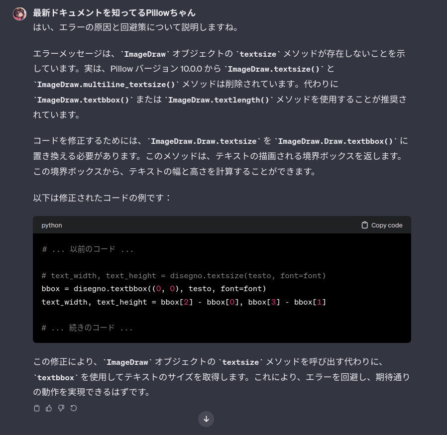

# WEBドキュメントをカスタムGPTsとして作成する方法


この記事で作成されたカスタムGPTsは、`最新ドキュメントを知ってるPillowちゃん`として共有します。
https://chat.openai.com/g/g-9bLQujz1z-zui-xin-dokiyumentowozhi-tuterupillowtiyan


## はじめに

皆さんがGPT-4を使ってコーディングをするとき、GPT-4が「非推奨のメソッド」を提案することはありませんか？また、GPT-4が「この関数は存在しません」と言っているのに、その関数が実際には存在することはありませんか？

本来、このような現象を解決するために、GPT-4に「WEBブラウジング機能」が実装されたのでした。

一般的に、GPT-4はBingのような検索エンジンを使用して情報を検索し、最新かつ的確な情報を提供すると考えられがちです。

しかし、現実には、うまく行きません。
単純な応答ならいざ知らず、GPT-4を使ってブレインストーミングをしていたり、コーディングのコパイロット的な使い方をする時、調べられた情報はその内容が浅く、またチャット中に忘れてしまうことが多いのです。

その結果、「使えねーな！！」となってしまいます。

この記事では、Web上のドキュメントを使用してGPTモデルを事前に学習させることにより、これらの問題を克服する方法を紹介します。

つまり、WEBドキュメントを使ってカスタムGPTsを作成します。

最初に結論の一部を紹介すると、単純にクローリングしたhtmlファイルの束をzip圧縮してアップロードしても、期待した成果は得られません。全てのドキュメントをPDFファイル化する必要があります。

もちろん、ドキュメントのPDF化は、半自動化したものを紹介します。

このアプローチにより、モデルが最新知識を持ち、対話の中での論理的一貫性が維持されます。

さて、この記事では題材として`Pillowドキュメント`を学習させます。
GPT-4はPillowを理解していますが、その知識は古く、かなり多くの非推奨メソッドを使いたがります。

## GPT-4が間違いを犯す例
例を挙げましょう。

stackoverflowから[Python pillow/PIL doesn't recognize the attribute "textsize" of the object "imagedraw"](https://stackoverflow.com/questions/77038132/python-pillow-pil-doesnt-recognize-the-attribute-textsize-of-the-object-imag)を見てみましょう。
Q&Aのベストアンサーは以下のとおりです。
```
textsize was deprecated, the correct attribute is textlength which gives you the width of the text. for the height use the fontsize * how many rows of text you wrote.
（textsize は非推奨になりました。正しい属性はテキストの幅を与える textlength です。）
```
質問されたエラーの出るコードは以下のとおりです。
```python

def metti_testo_su_sfondo(testo, sfondo, posizione=(10, 10), colore_testo=(0, 0, 0), dimensione_font=25):
# Apri l'immagine dello sfondo
immagine_sfondo = Image.open(sfondo)
disegno = ImageDraw.Draw(immagine_sfondo)
font = ImageFont.truetype("/usr/share/fonts/truetype/ubuntu/Ubuntu-R.ttf", dimensione_font)

text_width, text_height = disegno.textsize(testo, font=font)  # この行がエラー

# Calcola le coordinate del testo centrato
x = (immagine_sfondo.width - text_width) // 2
y = (immagine_sfondo.height - text_height) // 2

disegno.text((x, y), testo, fill=colore_testo, font=font)
immagine_sfondo.save("spotted.png")
testo_da_inserire = "Ciao, mondo!"
sfondo_da_utilizzare = "background.png"
metti_testo_su_sfondo(testo_da_inserire, sfondo_da_utilizzare)
```
エラー内容は以下のとおりです。
```bash
    text_width, text_height = disegno.textsize(testo, font=font)
                              ^^^^^^^^^^^^^^^^
AttributeError: 'ImageDraw' object has no attribute 'textsize'
```
つまり、`textsize`属性は無いと言われています。

### 質問内容
では、このエラーを質問してみましょう。
fontのパスと画像ファイル名を実際とおなじものに変更しています。

「
```python
def metti_testo_su_sfondo(testo, sfondo, posizione=(10, 10), colore_testo=(0, 0, 0), dimensione_font=25):
# Apri l'immagine dello sfondo
immagine_sfondo = Image.open(sfondo)
disegno = ImageDraw.Draw(immagine_sfondo)
font = ImageFont.truetype("/usr/share/fonts/truetype/ubuntu/Ubuntu-R.ttf", dimensione_font)

text_width, text_height = disegno.textsize(testo, font=font)  # この行がエラー

# Calcola le coordinate del testo centrato
x = (immagine_sfondo.width - text_width) // 2
y = (immagine_sfondo.height - text_height) // 2

disegno.text((x, y), testo, fill=colore_testo, font=font)
immagine_sfondo.save("spotted.png")
testo_da_inserire = "Ciao, mondo!"
sfondo_da_utilizzare = "background.png"
metti_testo_su_sfondo(testo_da_inserire, sfondo_da_utilizzare)
```
このコードを実行したところ、以下のエラーが発生しました。エラーの回避策をおしえて下さい。
```bash
    text_width, text_height = disegno.textsize(testo, font=font)
                              ^^^^^^^^^^^^^^^^
AttributeError: 'ImageDraw' object has no attribute 'textsize'
```
」

#### 最新のGPT-4に質問した場合の回答
「
提供されたコードには、`ImageDraw` オブジェクトの `textsize` メソッドに関するエラーが発生しています。`ImageDraw` オブジェクトには `textsize` メソッドは存在しません。このメソッドは `ImageFont` オブジェクトに属しています。したがって、`textsize` メソッドを使用する際には、`ImageFont` オブジェクトを使う必要があります。

以下に、修正されたコードを示します。コメントを追加して、各行の機能を明確にしました。

```python
from PIL import Image, ImageDraw, ImageFont  # PILモジュールをインポート

def metti_testo_su_sfondo(testo, sfondo, posizione=(10, 10), colore_testo=(0, 0, 0), dimensione_font=25):
    # 画像ファイルを開く
    immagine_sfondo = Image.open(sfondo)
    disegno = ImageDraw.Draw(immagine_sfondo)

    # フォントを設定
    font = ImageFont.truetype("/usr/share/fonts/truetype/ubuntu/Ubuntu-R.ttf", dimensione_font)

    # テキストのサイズを取得
    text_width, text_height = font.getsize(testo)  # フォントオブジェクトのgetsizeメソッドを使用する

    # テキストを中央に配置するための座標を計算
    x = (immagine_sfondo.width - text_width) // 2
    y = (immagine_sfondo.height - text_height) // 2

    # テキストを画像に描画
    disegno.text((x, y), testo, fill=colore_testo, font=font)

    # 画像を保存
    immagine_sfondo.save("spotted.png")

# テキストと背景画像を設定
testo_da_inserire = "Ciao, mondo!"
sfondo_da_utilizzare = "background.png"

# 関数を実行
metti_testo_su_sfondo(testo_da_inserire, sfondo_da_utilizzare)
```

この修正により、`ImageDraw` オブジェクトの `textsize` メソッドのエラーを回避し、期待通りの動作を実現することができるはずです。また、フォントファイル `/usr/share/fonts/truetype/ubuntu/Ubuntu-R.ttf` が存在し、適切なパスに配置されていることを確認してください。
」

このように回答しました。
**しかしこの回答は間違っています。**
`font.getsize`はPillow バージョン 10.0.0 で削除されています。ですのでコードを変更してもエラーが発生します。

このあと何度も質問しましたが、すべて間違った回答が返ってきました。


#### 「最新ドキュメントを知ってるPillowちゃん」に質問した場合の回答


「
はい、エラーの原因と回避策について説明しますね。

エラーメッセージは、`ImageDraw` オブジェクトの `textsize` メソッドが存在しないことを示しています。実は、Pillow バージョン 10.0.0 から `ImageDraw.textsize()` と `ImageDraw.multiline_textsize()` メソッドは削除されています【8†source】。代わりに `ImageDraw.textbbox()` または `ImageDraw.textlength()` メソッドを使用することが推奨されています。

コードを修正するためには、`ImageDraw.Draw.textsize` を `ImageDraw.Draw.textbbox()` に置き換える必要があります。このメソッドは、テキストの描画される境界ボックスを返します。この境界ボックスから、テキストの幅と高さを計算することができます。

以下は修正されたコードの例です：

```python
# ... 以前のコード ...

# text_width, text_height = disegno.textsize(testo, font=font)
bbox = disegno.textbbox((0, 0), testo, font=font)
text_width, text_height = bbox[2] - bbox[0], bbox[3] - bbox[1]

# ... 続きのコード ...
```

この修正により、`ImageDraw` オブジェクトの `textsize` メソッドを呼び出す代わりに、`textbbox` を使用してテキストのサイズを取得します。これにより、エラーを回避し、期待通りの動作を実現できるはずです。
」

このような回答を得ましたのでコードを修正し実行したところ、エラーは回避され、期待通りの動作をすることができました。

- background.png（背景画像）
  
- spotted.png（生成された画像）
  

